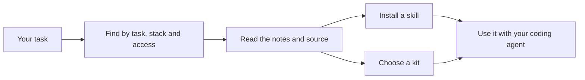

<div align="center">

# Fieldbook

**Find the right skill for the work in front of you.**

A reviewed directory of agent skills for planning, building, debugging and shipping software.

[Browse the directory](https://fieldbook.tech/skills/) · [Explore kits](https://fieldbook.tech/kits/) · [How review works](https://fieldbook.tech/review/) · [Submit a skill](https://fieldbook.tech/submit/)

</div>

---

Agent skills give your coding agent a repeatable way to work. Finding one means figuring out what it does, whether it fits your stack, and what it will ask your agent to touch.

[Fieldbook](https://fieldbook.tech) brings those details together. Start with your task, narrow by your stack and access preferences, then read the source notes before installing. Fieldbook originals by [Aarav Kashyap](https://github.com/AaravKashyap12) sit alongside community skills and official vendor sources. Every listing keeps its own author, repository and licence.

## Find a skill, then get back to work

- **Search by the job.** Plan a feature, write tests, fix a bug, secure an app or ship a release.
- **Match your stack.** Filter by language, framework, database or infrastructure. General-purpose skills remain available across stacks.
- **See what it touches.** Access labels describe instructions involving edits, commands, git, network access, browsers, MCP or subagents.
- **Read before installing.** Each page includes a summary, review notes, source link, licence and install command.
- **Start with a kit.** Small collections cover workflows such as planning, bug hunting and code review.
- **Follow what changes.** Daily snapshots track recorded installs and repository stars. Follow the [RSS feed](https://fieldbook.tech/feed.xml) for additions.



## Install a listed skill

Open a [skill page](https://fieldbook.tech/skills/) and copy its command. Fieldbook uses the Skills CLI:

```sh
npx skills add owner/repository --skill skill-name
```

Replace the placeholders with the values from the listing. The CLI asks which supported agents to install for, including Claude Code and Codex. Add `-g` if you want a global installation. Kit pages collect the individual commands in one place.

Fieldbook is the directory; you install each skill from its author's repository.

## What “reviewed” means

| Signal | What it tells you |
| --- | --- |
| Source and licence | The listing identifies the upstream repository, author and licence. Community sources must meet the [admission policy](REVIEWING.md). |
| Automated checks | The published `SKILL.md` is checked for frontmatter problems and scanner matches. These checks do not execute the skill. |
| Review notes and access labels | The listing describes its scope, dependencies and the actions its instructions request. |
| Read in full | A separate mark records a human reading the instructions and referenced files end to end. Automated checks do not earn this mark. |
| Daily snapshots | Install counts come from skills.sh; stars and repository activity come from GitHub. Unavailable counts remain unknown. |

A review is **not a security audit or a guarantee**. Not every skill has runtime testing, and upstream instructions can change after review. Read what you install and check its requirements against your project.

Missing or invalid reviews and uncleared scanner findings pause a listing and remove its install controls. Cleared findings are bound to an exact source hash. A temporary network or server failure can retain the last good review for the same source, visibly labelled as retained; successfully fetched changes and new findings must receive their own result. If more than 10% of fetches fail, the daily job fails before committing an update.

## Suggest a skill

Use the [submission form](https://fieldbook.tech/submit/) to open a prefilled GitHub issue. **Submissions are public—do not include secrets.**

Community listings need an established source: an official vendor or organisation repository, at least 100 GitHub stars, or at least 1,000 skills.sh installs. The repository must also be at least 60 days old. Fieldbook originals are exempt from this source threshold. Meeting the threshold does not replace review.

See [REVIEWING.md](REVIEWING.md) for the full process, listing fields and review requirements. Report vulnerabilities through [private vulnerability reporting](https://github.com/AaravKashyap12/fieldbook/security/advisories/new).

## Run locally

The site is static HTML, CSS and JavaScript, built with Node.js. There are no package dependencies to install. Use Node.js 20 or later; CI uses Node.js 22.

```sh
git clone https://github.com/AaravKashyap12/fieldbook.git
cd fieldbook
npm run build
npm run check
npm start
```

Open [localhost:4173](http://127.0.0.1:4173). Generated files go into `dist/`, which stays out of git.

| Command | Purpose |
| --- | --- |
| `npm run build` | Generate the site, feed, search index, sitemap and security contact file. |
| `npm run check` | Run security assertions and validate content and generated pages. |
| `npm start` | Serve the built site locally. |
| `npm run sync` | Fetch today's install counts and repository statistics. |
| `npm run review` | Refresh automated checks for listed skills. |
| `npm run daily` | Run sync, review, build and check in order. |

## Inside the repository

| Path | Purpose |
| --- | --- |
| `content/skills.json`, `content/skillmd/` | Fieldbook originals and their saved instructions. |
| `content/directory.json` | Community listings, summaries, access labels and source notes. |
| `content/taxonomy.json`, `content/categories.json` | Task and stack filters, and stages of engineering work. |
| `content/kits.json`, `content/authors.json`, `content/agents.json` | Kits, maintainer attribution and the home page's agent marks. |
| `content/review.json`, `content/stats/` | Automated review results and dated statistics. |
| `scripts/build.mjs`, `scripts/lib/` | Page generation, shared components and data handling. |
| `scripts/sync-stats.mjs`, `scripts/review.mjs`, `scripts/check.mjs` | Data refresh, review and validation. |
| `assets/` | Styles, progressive interactions, optional interface sounds, fonts and social preview. |
| `.github/` | Submission template and daily update workflow. |

[DESIGN.md](DESIGN.md) documents the design system. [SECURITY-VERIFICATION.md](SECURITY-VERIFICATION.md) records security checks and remaining work.

## Publishing and daily updates

[fieldbook.tech](https://fieldbook.tech) runs on Vercel through the repository's native Git integration. Pushes to `main`, including daily data commits, trigger deployment. Cloudflare manages DNS, with the Vercel records set to DNS only.

`vercel.json` defines the build command, `dist/` output, redirects and security headers. The build checks for configuration drift. For an intentional hosting change, run `npm run build -- --update-vercel`, inspect the generated configuration, run `npm run check` and commit it.

The daily GitHub Action runs on `main`, spaces skills.sh requests and backs off on rate limits, then commits only statistics, review results and generated Vercel configuration after the checks pass. Install growth appears when comparable snapshots exist. Separating CI read/write jobs and adding dependency-update automation remain deferred; see the security record for details.

## Attribution

Listed skills retain their upstream licences. Font licences are included for [Geist and Geist Mono](assets/fonts/OFL.txt) and [Instrument Serif](assets/fonts/InstrumentSerif-OFL.txt). Agent marks are sourced from Simple Icons (CC0).
